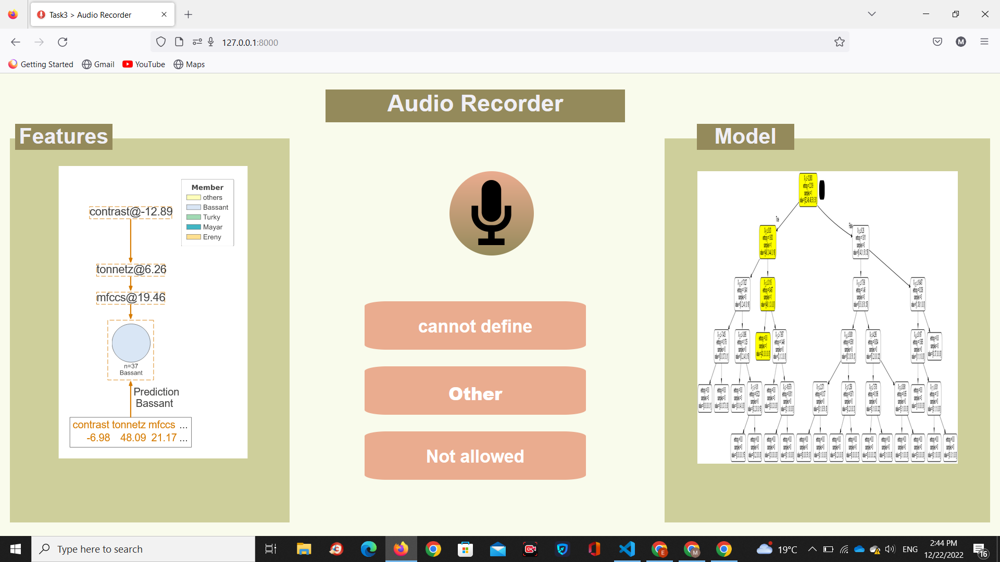

# Voice Recognition || DSP_Task_3


## Table of contents:

- [Introduction](#introduction)
- [Work Process](#work-process)
- [Project Features](#project-features)
- [Project full Demo](#project-full-demo)
- [Project Structure](#project-structure)
- [How to Run The Project](#run-the-project)
- [Team](#Team)

### Introduction

Voice Password checker is web application that is used for identifying an individual's voice and recognizing the words said (voice fingerprint)with correct sentence said. Team Members are only authorized with "Open the door,Close the door" sentence.

### Work Process

- Voice Feature Extraction depending on MFCCs:

- Models Training for user and sentence identification

- Model Deployment using web technologies (Flask, Html, CSS, JS)

### Project Features

In this web application you can

> 1. Visulaization for input audio features
>    
> 2. Models (User and Sentence)
>    


### Project full Demo 


>    .png)
<br></br>
>    .png)
<br></br>
>    .png)
<br></br>
>    .png)
<br></br>
>    
<br></br>
### Project Structure

The Web Application is built using:

- Frontend:
  - HTML
  - CSS
  - JavaScript
- Backend framework:
  - Flask (Python)

```
main
├─ Notebooks
├─Sound recordings
├─ static (JS & CSS files)
│  ├─  css
│  ├─  img
│  └─  js
├─ template (HTML files)
├─ server.py (Back-End Server)
├─ functons.py (Audio preprocessing and Models Predictions)
└─ README.md
```

### Run the Project

1. Install the following packages
   - numpy
   - flask
   - Librosa
   - pickle
   - scipy
   - sklearn
   - python_speech_features

- Open Project Terminal & Run

```
pip install -r requirments.txt
```

2. Start Server by Running

```
python app.py
```

3. Visit http://127.0.0.1:8000

### Team

First Semester - Biomedical Digital Signal Processing project created by:

| Team Members' Names                                  | Section | B.N. |
| ---------------------------------------------------- | :-----: | :--: |
| [Ereny Eleya ](https://github.com/ErenyEleya)        |    1    |  18  |
| [Bassent Medhat](https://github.com/bassantmedhat)   |    1    |  21  |
| [Mariam Turky](https://github.com/MariamTurky)       |    2    |  30  |
| [Mayer Fayez](https://)                              |    2    |  50  |

